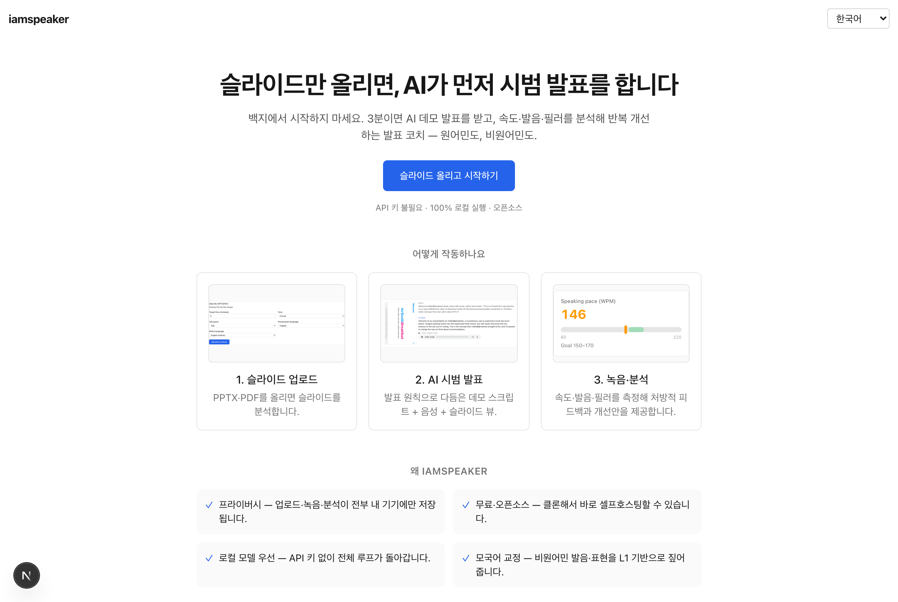
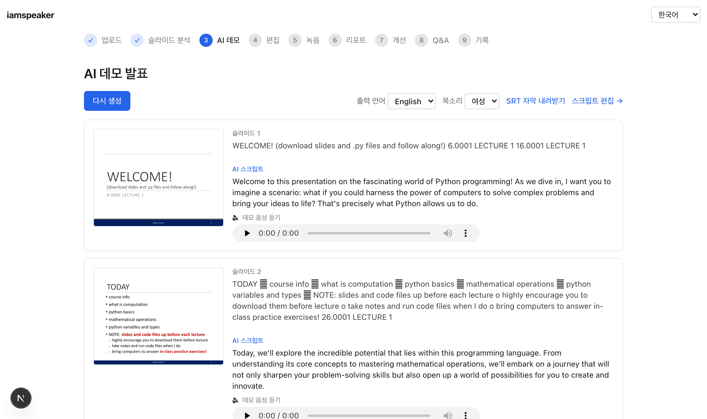
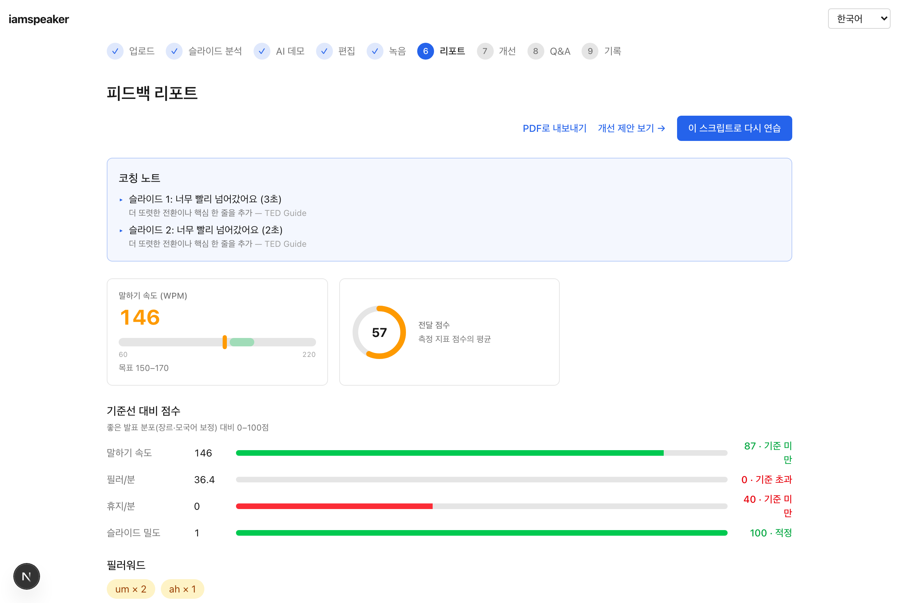
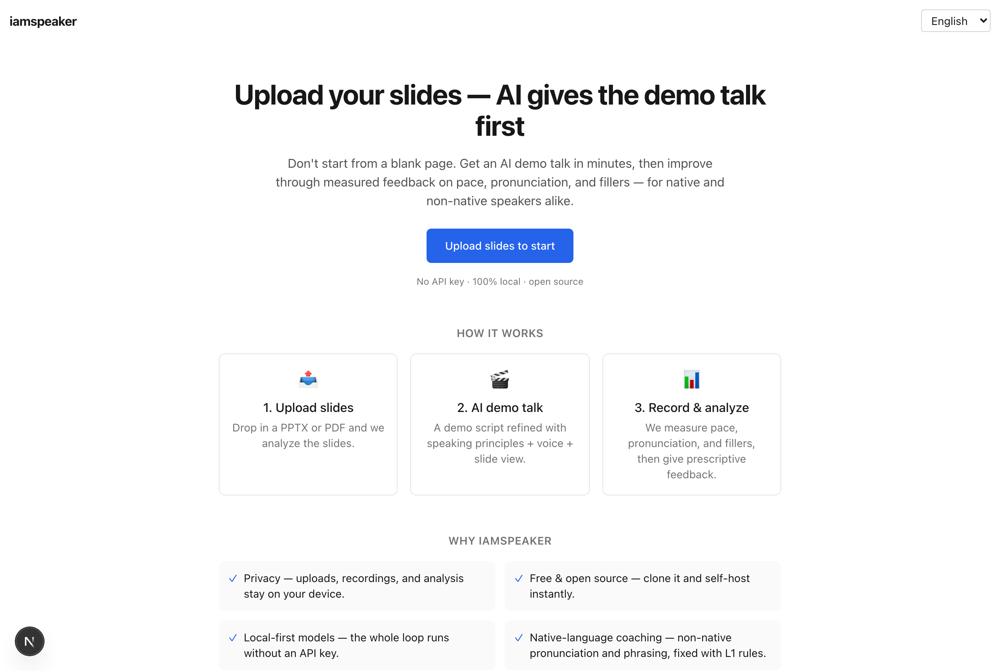
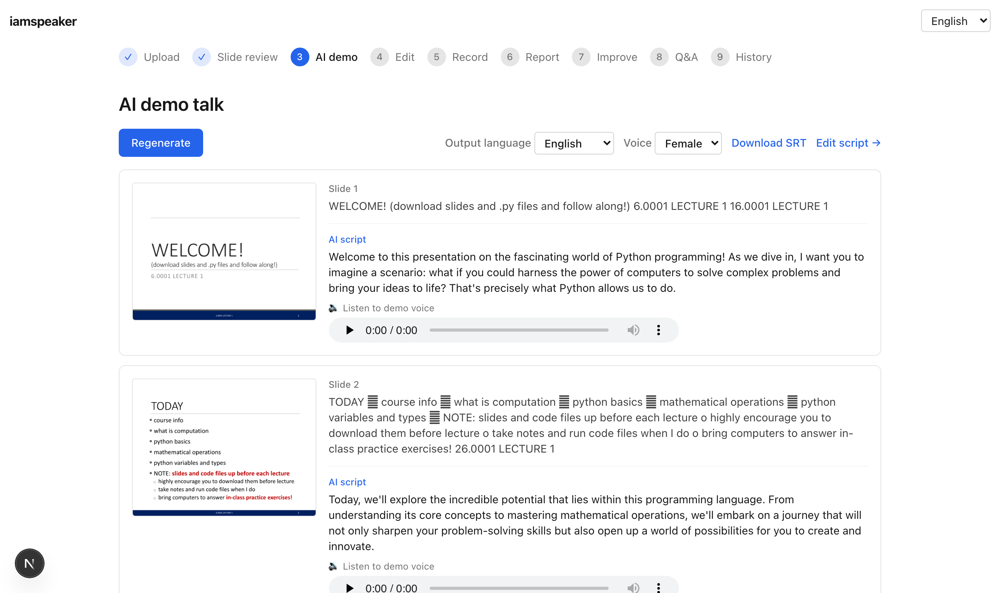
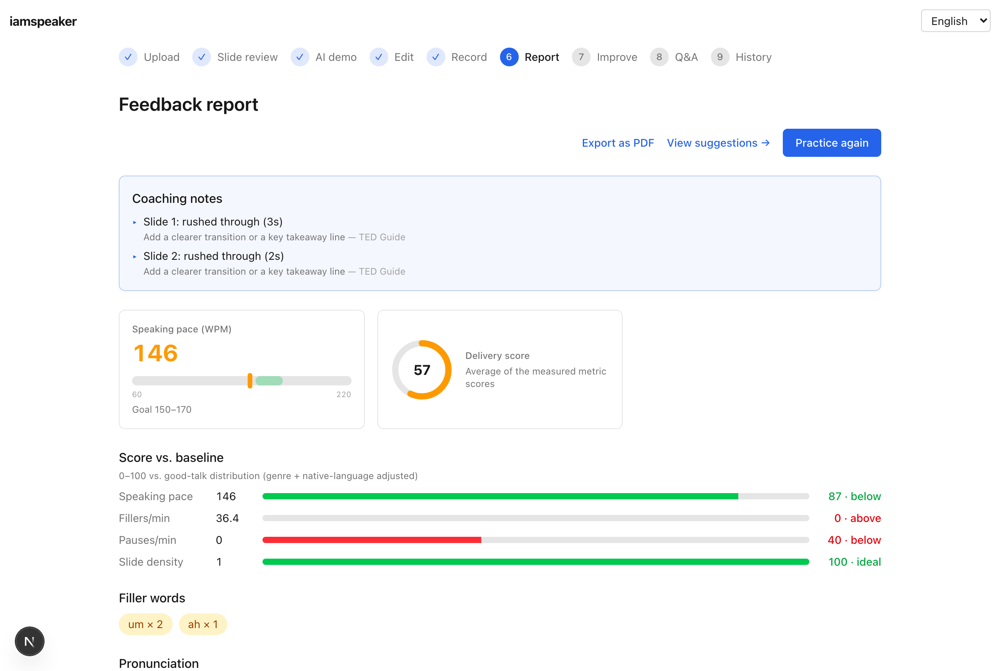

# iamspeaker

[English](README.md) · **한국어**

> 슬라이드를 업로드하면 AI가 먼저 시범 발표(데모)를 생성하고, 사용자가 참고해 연습 녹음을 하면 **속도·발음·필러워드**를 분석해 피드백과 개선 스크립트를 제공하는 **오픈소스 발표 연습 웹앱**.

  

영어로 발표·피칭하는 **누구나** — 백지 상태에서 시작하지 않도록 AI가 먼저 시범 발표를 보여주고, 속도·필러·페이스·발음·단어 선택·억양 등 객관적 데이터로 반복 개선하도록 돕는다. 코치 루프(측정→처방→재연습→추이)는 원어민·비원어민 모두에게 유효하며, **영어가 모국어가 아니면** 모국어(L1) 기반 발음·표현 교정까지 더해진다.

> **상태: v0.5.0 — 코칭 확장 + 다국어 출력.** v0.4.0 슬라이드 뷰어·게이지 위에 **단어 사용 코칭**(신뢰도를 낮추는 hedging + CEFR 고급 어휘), **억양 분석**(녹음에서 단조 피치 검출), **다국어 출력**(발표를 대상 언어로 번역+자막+음성), **GOP 자동 승격**(wav2vec2 가용 시 자동, 아니면 휴리스틱) 추가. 로컬 모델만으로 전체 루프 완주 가능. 개발 기록은 [`PROGRESS.md`](PROGRESS.md), 기여는 [`CONTRIBUTING.md`](CONTRIBUTING.md).

## 핵심 원칙
- **오픈소스 / 셀프호스팅 우선** — 누구나 클론해서 띄울 수 있다.
- **로컬/오픈소스 모델 우선** — STT/TTS/LLM은 기본 로컬 동작. 클라우드 API는 *선택적 업그레이드*.
- **API 키 강제 없음** — `cp .env.example .env` 후 로컬 모델만으로 전체 루프가 돌아간다.
- **데이터는 전부 로컬 저장** — 업로드·녹음·분석 결과는 `data/`에만 저장된다 (프라이버시).

**"매일 함께 훈련하는 코치"** — 한 번 봐주는 선생님이 아니라, 연습 이력을 쌓으며 반복 개선을 돕습니다.

**대시보드**(내 발표 관리·검색·삭제) → 슬라이드 업로드(PPTX/PDF) → 슬라이드 분석(디자인 원칙 기반 비평) → **AI 데모 발표**(명저 발표 원칙으로 self-improve한 스크립트를 실제 슬라이드와 함께 + Piper TTS) → 스크립트 편집(**라이브 어휘 점검** — 고급 단어 표시) → 연습 녹음 → **분석 리포트**(WPM·필러·발음 점수/음소·**억양**·시간배분 + **게이지 카드** + **목표 대비 점수** + **처방적 코칭 노트**[슬라이드별 "어디서 무엇을", **단어 사용** 위험 포함 + 출처 있는 원칙 팁] + **PDF 내보내기**) → **개선 제안**(측정된 약점·원칙을 겨냥) → **이 스크립트로 다시 연습**(루프백) → **회차별 추이·베스트·목표 설정** → **회차 1:1 비교**(점수 델타 + 코칭 노트 변화) → 예상 Q&A 대비 → **다국어 출력**(대상 언어로 번역·자막 SRT·음성).

발표 특화 지표(속도·페이스 변화·필러·침묵·발음 GOP)는 로컬에서 동작하고, 연습 이력은 100% 내 기기에만 저장됩니다. UI 5개 언어(ko/en/ja/zh/es), L1 발음 교정 4개 언어(ko/ja/zh/es).

화면·기능 명세는 [`docs/storyboard.md`](docs/storyboard.md), 설계는 [`DEVELOPMENT.md`](DEVELOPMENT.md) 참고.

## 스크린샷

**홈 — 슬라이드만 올리면 AI가 먼저 시범 발표**


**AI 데모 발표 — 실제 슬라이드를 보며 스크립트·음성을 리뷰**


**피드백 리포트 — 속도·발음·점수를 게이지로, 슬라이드별 처방 코칭 노트**


<details>
<summary><b>English UI</b> (UI 5개 언어 지원 — ko/en/ja/zh/es)</summary>





</details>

## 라이선스
[MIT](LICENSE) © Seung Park. TED 등 외부 코퍼스는 비저작권 메트릭만 내재화([`docs/benchmark.md`](docs/benchmark.md) 참고).

## 요구 사항
- Node 22 LTS, pnpm (corepack)
- ffmpeg, LibreOffice(headless) — 오디오 변환 / PPTX→PDF
- 로컬 모델 구동 기준 **RAM 8GB 이상 권장**
- 로컬 AI 엔진: [Ollama](https://ollama.com) (LLM) · [Piper](https://github.com/rhasspy/piper) (TTS) · [Whisper.cpp](https://github.com/ggerganov/whisper.cpp) (STT) — Docker 사용 시 자동 포함

## 빠른 시작

### Docker (권장)
앱 + Ollama + ffmpeg/LibreOffice/Whisper.cpp/Piper를 한 번에 띄운다.
```bash
docker compose up --build
# ollama-pull가 기본 모델(llama3.1:8b, ~4.7GB)을 받고,
# app 컨테이너가 첫 기동에 Whisper/Piper 모델을 data 볼륨에 받는다(최초 1회, 수 분).
# → http://localhost:3000
```
- 다른 LLM 모델: `OLLAMA_MODEL=qwen2.5:14b docker compose up --build` (품질↑, RAM↑).
- 데이터(업로드·녹음·DB·모델)는 `./data`에만 저장.
- 첫 `docker compose up`은 빌드(whisper.cpp 정적 컴파일·LibreOffice)와 모델 다운로드로 시간이 걸리고 용량이 크다. 이후 실행은 빠르다.
- ✅ macOS(Apple Silicon, colima/Docker Desktop)에서 `docker compose up --build` 전체 루프 검증됨(LLM 생성·Piper TTS·Whisper STT·번역·SRT).

### 네이티브
```bash
cp .env.example .env       # 로컬 모델만으로 동작 (API 키 불필요)
pnpm install
pnpm setup:models          # Whisper 모델 / Piper voice 다운로드
pnpm preflight             # 외부 바이너리 점검(선택)
pnpm dev                   # http://localhost:3000
```
macOS는 Piper 정적 바이너리가 불안정 → `pip install piper-tts` 후 `.env`에 `PIPER_BIN`을 절대경로로 지정(`which piper`).

## LLM 모델 선택 (품질 vs 리소스)
기본 `OLLAMA_MODEL`은 `llama3.1:8b`(낮은 진입장벽). `hermes3:8b`는 동계열 drop-in으로 라이브 검증에 사용한다. 더 나은 데모 스크립트 분량·번역 품질을 원하면 `.env`에서 더 큰 모델로 바꾼다.

| 모델 | 크기 | 권장 RAM | 비고 |
|------|------|---------|------|
| `llama3.1:8b` / `hermes3:8b` | ~5GB | 8GB+ | 기본. 데모가 목표 시간 대비 짧고 번역 품질 제한적 |
| **`qwen2.5:14b`** | ~9GB | **16GB+** | **권장**. 분량·다국어(ko/ja/zh) 번역이 뚜렷이 개선 |
| 32B+ / 클라우드 | — | 32GB+ | 긴 발표(10분+) 분량 완전 수렴엔 더 큰 모델 권장 |

실측(2026-06-21, M2 Pro 16GB): 5분 피칭 생성 분량 8b 62 → 14b 105 wpm, 번역도 8b의 미번역·깨짐이 14b에서 대부분 해소(숫자 단위 현지화는 잔여 약점). 인프라(어댑터/프롬프트/자가개선 루프)는 모델 무관하게 정상 동작 — 품질은 모델 크기에 비례.

## 정밀 발음 평가 (선택)
기본 발음 분석은 STT confidence + L1 음소 휴리스틱(의존성 0)이다. 더 정밀한 **GOP(wav2vec2 강제정렬)** 평가로 업그레이드할 수 있다(옵션).

```bash
pip install -r scripts/pronunciation/requirements.txt   # torch·torchaudio·transformers·phonemizer·espeakng_loader (pip만, 시스템 espeak 불필요)
# .env
PRONUNCIATION_SCORER=wav2vec2
```
대본을 오디오에 강제정렬해 음소별 발음 정확도(GOP)를 산출한다(STT 타임스탬프 비의존). 정상 발음은 통과, 실제 오발음은 해당 음소를 잡아 L1 규칙과 연결한다. 첫 실행 시 음소 모델(~1GB) 다운로드. 실패 시 휴리스틱으로 자동 폴백.

## 클라우드 어댑터 (선택)
환경변수로 더 높은 품질의 클라우드 엔진을 켤 수 있다. 설정 시 우선 사용되고, 없으면 로컬로 폴백한다.

| 기능 | 클라우드 | 환경변수 |
|------|---------|---------|
| Script/Q&A | Claude API, OpenAI | `ANTHROPIC_API_KEY`, `OPENAI_API_KEY` |
| TTS | ElevenLabs | `ELEVENLABS_API_KEY` |
| STT | Azure Speech | `AZURE_SPEECH_KEY`, `AZURE_SPEECH_REGION` |

전체 변수는 [`.env.example`](.env.example) 참고.

## 기여
화면 ID(SCR-XX)·Epic 번호를 커밋/PR에 동일하게 참조한다 (예: `feat(SCR-04): 녹음 컨트롤`). 작업 규칙은 [`CLAUDE.md`](CLAUDE.md).

## 라이선스
[MIT](LICENSE) © 2026 Seung Park
