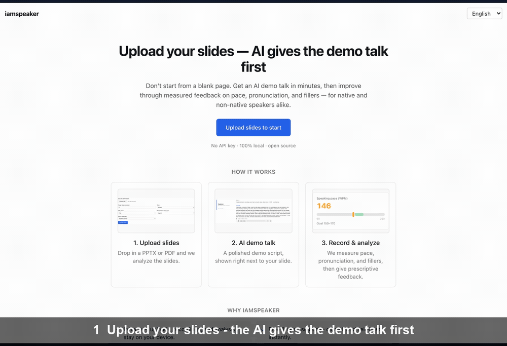

# iamspeaker

**English** · [한국어](README.ko.md)

> An **open-source presentation-practice web app**: upload your slides, the AI gives a demo talk first, then you record your own run and it analyzes your **pace, pronunciation, and filler words** to return feedback and an improved script.

[](https://github.com/spark798/iamspeaker/actions/workflows/ci.yml)    [](https://github.com/spark798/iamspeaker/stargazers)

> ⭐ **If this saves you prep time, a star helps others find it.**



For **anyone** who presents or pitches in English — instead of starting from a blank page, the AI shows a demo talk first, then helps you improve through objective data: pace, fillers, rhythm, pronunciation, word choice, and intonation. The coach loop (measure → prescribe → re-practice → trend) works for native and non-native speakers alike, and **if English isn't your first language**, it adds native-language (L1) pronunciation and phrasing coaching on top.

> **Status: v0.5.0 — expanded coaching + multilingual output.** On top of the v0.4.0 slide viewer & gauges: **word-usage coaching** (credibility-weakening hedging + CEFR-level advanced vocabulary), **intonation analysis** (monotone-pitch detection from your recording), **multilingual output** (translate the talk + subtitles + voice into your target language), and **auto-promoted GOP pronunciation** (uses wav2vec2 when available, falls back to heuristics). The whole loop runs on local models alone. Release notes in [`CHANGELOG.md`](CHANGELOG.md), dev log in [`PROGRESS.md`](PROGRESS.md), contributing in [`CONTRIBUTING.md`](CONTRIBUTING.md).

## Core principles
- **Open source / self-host first** — anyone can clone and run it.
- **Local / open-source models first** — STT/TTS/LLM run locally by default. Cloud APIs are an *optional upgrade*.
- **No mandatory API keys** — after `cp .env.example .env`, the whole loop runs on local models alone.
- **All data stays local** — uploads, recordings, and analysis are stored only under `data/` (privacy).

**"A coach you train with every day"** — not a teacher who looks once, but a coach that builds your practice history and helps you improve over repeated takes.

**Dashboard** (manage / search / delete your talks) → upload slides (PPTX/PDF) → slide critique (design-principle based) → **AI demo talk** (a script self-improved with principles from great public-speaking books, shown next to your rendered slide + Piper TTS) → edit script (with a **live vocabulary check** — flags advanced words) → record a practice run → **analysis report** (WPM · fillers · pronunciation score/phonemes · **intonation** · time breakdown + **gauge cards** + **score vs. goal** + **prescriptive coaching notes** [per-slide "where & what", incl. **word-usage** risks, + sourced principle tips] + **PDF export**) → **improvement suggestions** (targeting your measured weaknesses) → **re-practice this script** (loopback) → **per-take trend · best · goal setting** → **take-to-take comparison** (score deltas + coaching-note changes) → expected-Q&A prep → **multilingual output** (translation · subtitles SRT · voice, in your target language).

Presentation-specific metrics (pace, pace variation, fillers, silence, pronunciation GOP) run locally, and your practice history stays 100% on your own device. UI in 5 languages (ko/en/ja/zh/es), L1 pronunciation coaching in 4 (ko/ja/zh/es).

See [`docs/storyboard.md`](docs/storyboard.md) for the screen/feature spec and [`DEVELOPMENT.md`](DEVELOPMENT.md) for the design.

## Screenshots

**Home — upload your slides and the AI gives the demo talk first**


**AI demo talk — review the script and voice next to the actual slide**


**Feedback report — pace/pronunciation/score as gauges, with per-slide prescriptive coaching notes**


<details>
<summary><b>한국어 UI</b> (5 UI languages — ko/en/ja/zh/es)</summary>


</details>

## License
[MIT](LICENSE) © Seung Park. External corpora such as TED are internalized as non-copyrightable metrics only (see [`docs/benchmark.md`](docs/benchmark.md)).

## Requirements
- Node 22 LTS, pnpm (corepack)
- ffmpeg, LibreOffice (headless) — audio conversion / PPTX→PDF
- **8GB+ RAM recommended** for running local models
- Local AI engines: [Ollama](https://ollama.com) (LLM) · [Piper](https://github.com/rhasspy/piper) (TTS) · [Whisper.cpp](https://github.com/ggerganov/whisper.cpp) (STT) — included automatically with Docker

## Quick start

### Docker (recommended)
Brings up the app + Ollama + ffmpeg/LibreOffice/Whisper.cpp/Piper in one go.

**Prebuilt image (fastest — no local build):**
```bash
docker compose pull        # pulls ghcr.io/spark798/iamspeaker (skips compiling whisper.cpp + installing LibreOffice)
docker compose up -d
# ollama-pull fetches the default model (llama3.1:8b, ~4.7GB), and the app
# downloads the Whisper/Piper models into the data volume on first boot (once).
# → http://localhost:3000
```

**Build from source (for development / customization):**
```bash
docker compose up --build
```
- Different LLM model: `OLLAMA_MODEL=qwen2.5:14b docker compose up -d` (higher quality, more RAM).
- All data (uploads, recordings, DB, models) is stored only under `./data`.
- First boot still downloads the LLM (~4.7GB) and Whisper/Piper models once; the prebuilt image just skips the slow build (compiling whisper.cpp statically + installing LibreOffice).
- Verified end-to-end on macOS (Apple Silicon, colima/Docker Desktop): the full core loop (LLM generation · Piper TTS · Whisper STT · translation · SRT) **and PPTX→PDF slide thumbnails** (LibreOffice + `@napi-rs/canvas`) in-container. Translated TTS and prosody are wired into the same image but haven't been separately re-verified in a container — please open an issue if you hit a first-run problem.
- The prebuilt image is **multi-arch** (`linux/amd64` + `linux/arm64`) — runs natively on Intel/AMD and on Apple Silicon / ARM servers.

### Native
```bash
cp .env.example .env       # runs on local models only (no API key)
pnpm install
pnpm setup:models          # download Whisper model / Piper voices
pnpm preflight             # check external binaries (optional)
pnpm dev                   # http://localhost:3000
```
On macOS the Piper static binary is flaky → `pip install piper-tts`, then set `PIPER_BIN` in `.env` to an absolute path (`which piper`).

## Choosing an LLM model (quality vs. resources)
The shipped default `OLLAMA_MODEL` is `llama3.1:8b` — kept only for a low-barrier first run (fits 8GB, works out-of-box everywhere). **For real use we strongly recommend `qwen2.5:14b`**: noticeably tighter demo scripts and clearly better translation, switched with one `.env` line and no code change (`hermes3:8b` is a same-family 8b drop-in used in live verification).

| Model | Size | Recommended RAM | Notes |
|------|------|---------|------|
| `llama3.1:8b` / `hermes3:8b` | ~5GB | 8GB+ | Default. Demos run short vs. the target time, and translation quality is limited |
| **`qwen2.5:14b`** | ~9GB | **16GB+** | **Recommended**. Noticeably better length and multilingual (ko/ja/zh) translation |
| 32B+ / cloud | — | 32GB+ | For long talks (10min+) to fully converge on length, a larger model is recommended |

Measured (2026-06-21, M2 Pro 16GB): a 5-minute pitch generated 62 wpm worth on 8b → 105 wpm on 14b; translation's untranslated/garbled spots on 8b were mostly resolved on 14b (localizing number units remains a residual weakness). The infrastructure (adapters / prompts / self-improvement loop) works regardless of model — quality scales with model size.

Also measured (2026-07-02, native Ollama/Metal): translating a slide script to Korean, 8b garbled the product name and a common idiom while 14b stayed fluent and accurate; on that deck 14b's win was script density/quality rather than raw length.

> **Running 14b under Docker (Apple Silicon / low RAM):** the bundled `ollama` container runs inside the Docker VM (colima defaults to ~8GB), which is too small to load 14b (it needs ~8.5GB) — you'll get an Ollama 500 (out-of-memory). Run Ollama **natively** instead (Metal GPU + full unified memory): `ollama pull qwen2.5:14b`, then add a local `docker-compose.override.yml` pointing the app at it (`OLLAMA_HOST=http://host.docker.internal:11434`, `OLLAMA_MODEL=qwen2.5:14b`). Or give the VM more room: `colima start --memory 12`.

> **Swap models any time — zero code changes.** iamspeaker only talks to the Ollama HTTP API (`OLLAMA_HOST`); it never touches the weights. Upgrade with `ollama pull hermes3:8b`, or switch to a bigger model with a single `.env` line (`OLLAMA_MODEL=qwen2.5:14b`) — no rebuild, no waiting. With Docker, `docker compose up` even runs the pull for you. Unlike SaaS coaches (Yoodli/Orai) where the vendor decides when models improve, you adopt any new Ollama model the day it lands. This is the payoff of the adapter pattern.

## Precise pronunciation scoring (optional)
The default pronunciation analysis is STT confidence + L1 phoneme heuristics (zero dependencies). You can upgrade to more precise **GOP (wav2vec2 forced alignment)** scoring (optional).

```bash
pip install -r scripts/pronunciation/requirements.txt   # torch · torchaudio · transformers · phonemizer · espeakng_loader (pip only, no system espeak)
# .env
PRONUNCIATION_SCORER=wav2vec2
```
It force-aligns the script to the audio to compute per-phoneme accuracy (GOP), independent of STT timestamps. Correct pronunciation passes; actual mispronunciations are caught at the phoneme and linked to L1 rules. The phoneme model (~1GB) downloads on first run. Falls back to heuristics on failure.

> **Known limitation (measured).** The phoneme model is multilingual (espeak), so on strongly-accented L2 speech it can **over-flag correctly-pronounced words** — a correct English phoneme loses probability to a same-sounding token from another language (e.g. Mandarin `ɕ i5` for English `ʃ iː`). Measured word-level precision is limited (see [`docs/benchmark.md`](docs/benchmark.md)); the utterance-level score is more reliable. A more robust scorer (phoneme-class posteriors / English-only model) is planned.

## Cloud adapters (optional)
You can enable higher-quality cloud engines via environment variables. When set, they take priority; otherwise it falls back to local.

| Feature | Cloud | Env var |
|------|---------|---------|
| Script/Q&A | Claude API, OpenAI | `ANTHROPIC_API_KEY`, `OPENAI_API_KEY` |
| TTS | ElevenLabs | `ELEVENLABS_API_KEY` |
| STT | Azure Speech | `AZURE_SPEECH_KEY`, `AZURE_SPEECH_REGION` |

See [`.env.example`](.env.example) for all variables.

## Contributing
Reference the screen ID (SCR-XX) and Epic number consistently in commits/PRs (e.g. `feat(SCR-04): recording controls`). Working rules in [`CLAUDE.md`](CLAUDE.md).

## License
[MIT](LICENSE) © 2026 Seung Park
